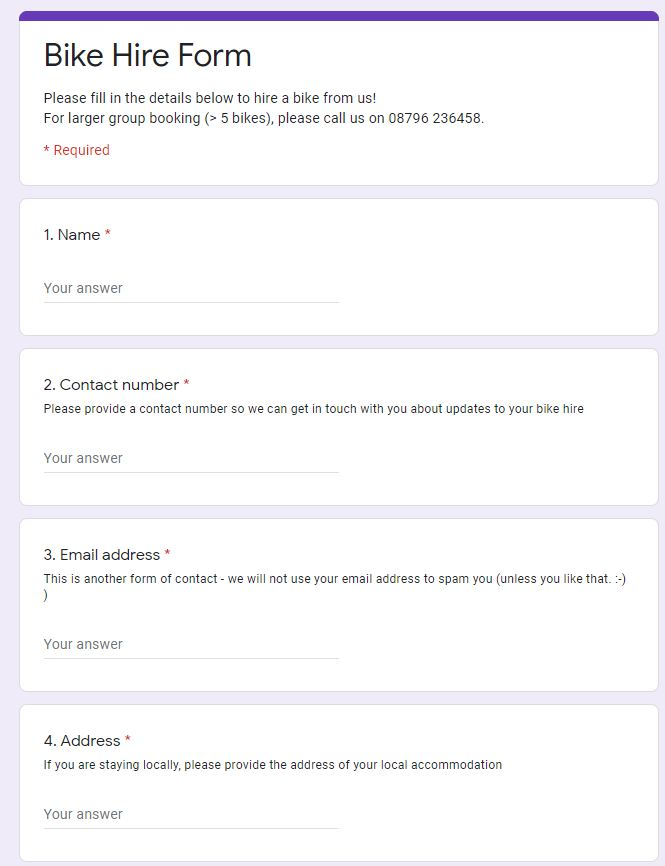
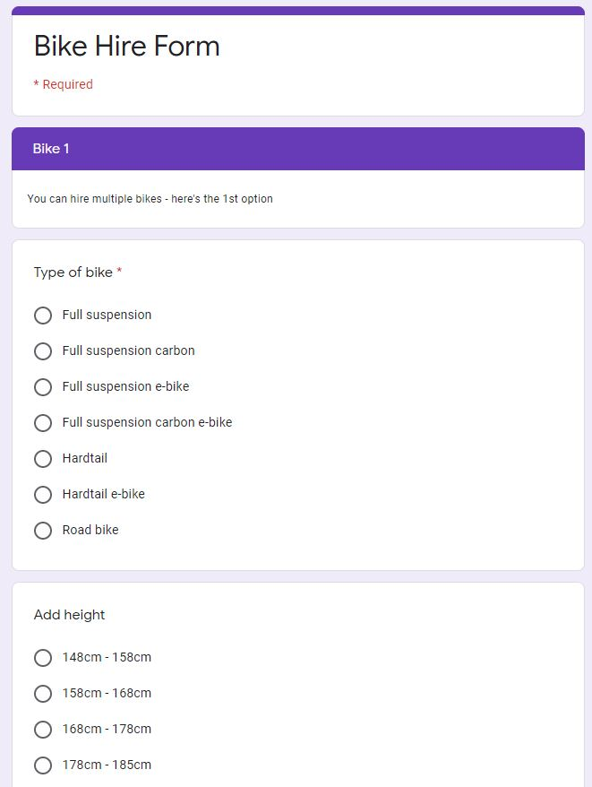
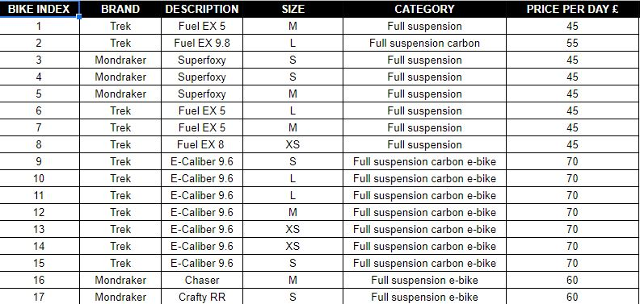
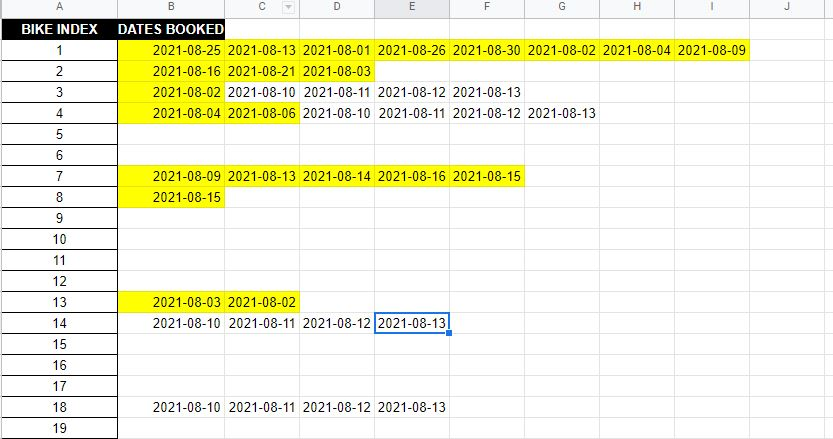
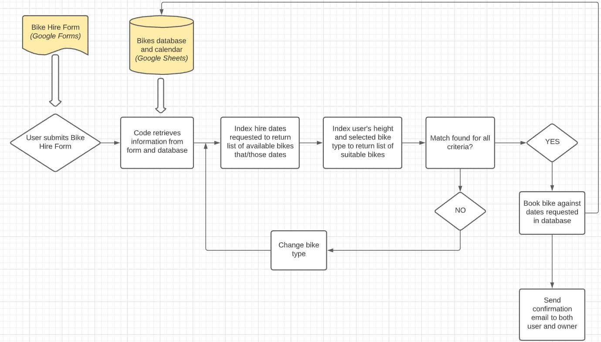
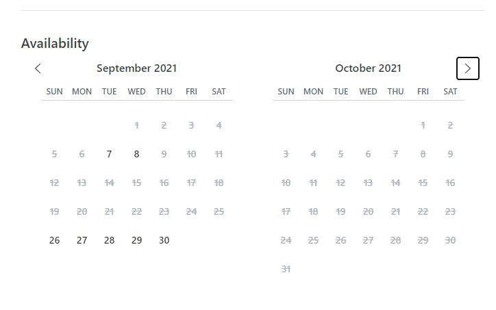

# Bike Hire System

## add comment about running of file

## Portfolio Project 3 - Python Essentials

The purpose of this project was to create a booking system whereby users can submit a Google form to enquire about bike hire, and if there are bikes available, the system will book these bikes out against a calendar, and send a confirmation email to both the user and shop owner. 

# Table of Contents
1. [Link to app](https://github.com/Michelle3334/battleships#link-to-app)
2. [Features](https://github.com/Michelle3334/battleships#features)
3. [Technologies Used](https://github.com/Michelle3334/battleships#technologies-used)
4. [Development](https://github.com/Michelle3334/battleships#development)
5. [Testing](https://github.com/Michelle3334/battleships#testing)
6. [Deployment](https://github.com/Michelle3334/battleships#deployment)
7. [Credits](https://github.com/Michelle3334/battleships#credits)
8. [Acknowledgements](https://github.com/Michelle3334/battleships#acknowledgements)

# Link to Google Form
The Google Form can be found <a href="https://docs.google.com/forms/d/e/1FAIpQLSf65gwDPHQ-m0Fo5ZylJY6MdEva9j5YLtU0maKbP4wvLUBw-Q/viewform" target="_blank" rel="noopener">here</a>. (Note: Right click on link to open a new tab).

# Link to Google Sheets

# Features
## Google Form (for user)
* The Google Form should be found as a link on the bike shop's (hypothetical) website.
* The form consists of basic contact information, then options to book bikes.
* There is a choice of bike type, and the rider should input their height to allow the correct bike size to be matched to them.
* Once submitted, the information from the form is pushed to the Google Sheets database. 

  

## Google Sheets (for website owner)
* The Google Sheets is the main library for data for the system.  
* It hosts a list of the bikes available, along with the sizes, price per day etc.
* It also assigns each bike a 'bike index' which is frequently used in the system as a reference for each bike.
* It also displays a basic calendar for the website owner to see calendar availablility, or update the available bikes list when bikes are sold, or new bikes bought in. 

## Python Code
1. The code initially retrieves information from the Google Sheets database, which was submitted by the user on the Google Form (function: get_latest_response) and outputs a list of dictionaries, with all relevant information about the bikes requested.

2. It uses the rider heights to match to the revelant bike size (function: match_size) and appends this information to the bike dictionaries for each bike.

3. It matches the price of the bike also, which varies depending on the bike type (function: match_price) and appends this information to the bike dictionaries for each bike. 

4. It looks at the calendar in the Google Sheet, as well as the hire dates requested from the user, and returns a list of unavailable bikes for those dates (function: find_unavailable_bikes).  This function is important to ensure no double bookings. 

5. It iterates through the bikes which are still available, to match up both the bike type and bike size, and return a list of suitable bikes for each bike in the bike dictionary (function: match_suitable_bikes).

6. There is another availability checking function (function: check_availability) to remove any bikes from the list of unavailable bikes from any bike dictionaries that bike index appears in.  Therefore it should not be possible to 'book' this bike again. 

7. It then iterates through the list of possible bikes for each bike dictionary (function: book_bikes), chooses one of the bike indexes, and calls up another function (function: book_bikes_to_calendar) which writes the requested hire dates in the calendar against the chosen bike index.

8. It then separates the list of bike dictionaries into two separate ones, one for booked bikes, and one for bikes which could not be booked on that iteration (function: booked_or_not). 
 
9. If there are any bikes which could not be booked, it then looks for alternatives by changing the bike type.  It is more important for the rider to be riding a bike of the correct size, but manageable to provide them with a different bike type if they wish (function: find_alternatives).  This then repeats steps 3 - 9.

See the process flow below:

[Back to Table of contents](#table-of-contents)

## Confirmation emails (for both user and owner)

## Future possible features
* There should be a website whereby the user can access the form. On this website could be a calendar, where users can see which bikes are and are not available on the dates they wish to hire.  This would be automatically updated by the system to block out dates when no longer available. 

For example, see similar booking system idea here for a campervan rental site:

# Technologies Used:
### Programming Languages:
* Python

### Git
* Git was used for version control by utilizing the Gitpod terminal to commit to Git and Push to GitHub.

### Github
* GitHub is used to store the projects code after being pushed from Git.

### Lucidchart
* Lucidchart was used to map the workflow for the game.

### Code Institutes mock terminal
* Code Institute provided a mock terminal for use for the project.

### Google Sheets
* Google Sheets was used to store the bikes information. The link to the sheet can be found <a href=# target="_blank" rel="noopener">here</a>. (Note: Right click on link to open a new tab).

[Back to Table of Contents](https://github.com/Michelle3334/battleships#table-of-contents)

# Development
* In order to access google sheets I needed to import the gspread module and credentials from the google.oauth2.service_account.
* I wanted the battleship to be placed randomly on the game board, so for that functionality I imported the random library.

# Limitations
## Number of bikes available for hire
There had to be a limit to how many bikes which could be hired, therefore this was limited to 5 bikes per form.  In the author's experience from running a similar business, generally larger bookings should be handled differently.
 
# Testing
## Functionality testing
* Each piece of code was tested in Gitpod as well as in Python Tutor (where possible).
* Family members and friends were asked to test the app once the final product was deployed.
## Code Validation
* The code was checked using Pep8online checker.

[Back to Table of Contents](https://github.com/Michelle3334/battleships#table-of-contents)

### Error checking
One of the most important aspects of a booking system is to ensure no double bookings occur.  For this reason, a number of error-checking measures are provided in the code. 
* The shop owner has the ability to choose a blanket availability to each bike index.  This allows for, for example,  mechanical problems with bikes thus rendering them unbookable for a few days, or the bike is sold and no longer present in the hire fleet.  
* The code checks the dates in the calendar and returns unavailable bikes for those dates.
* If a bike is booked, the code removes that bike index from all other bike dictionaries, and appends it to the unavailble bikes list. 
* The code checks and re-checks bikes availability each time the code is run. 

With all these measures, it should not be possible to double book a bike. 

* To add new bikes bought into the shop, the owner can simply add the bike to the bottom of the bikes list, with a new bike index.  This again ensures no confusion with double booking other bikes. 

* Maintenance
Calendar updates

* Manual booking

# Deployment
The project was deployed to GitHub Pages using the following steps, I used Gitpod as a development environment where I commited all changes to git version control system. I used the push command in Gitpod to save changes into GitHub:

1. Log in to GitHub and locate the GitHub Repository.
2. At the top of the Repository, click on the "Settings" Button on the menu.
3. Scroll down the Settings page until you locate the "Pages" Section.
4. Under "Source", click the dropdown called "None" and select "Master Branch" and click on save.
5. The page will automatically refresh.
6. The now published site link shows at the top of the page.

The project was then deployed to Heroku using the following steps:

1. Log in to Heroku and add a new app.
2. Link the project from GitHub to Heroku.
3. Add the CREDS.JSON file to the ConfigVars in Settings.
4. Add the Python and NodeJS buildpacks.
5. Manually deploy the project (I used the manual deploy option in order to control what version was deployed to the live environment).

# Credits
* https://mailtrap.io/blog/sending-emails-in-python-tutorial-with-code-examples/

# Acknowledgements
* 

[Back to Table of Contents](https://github.com/Michelle3334/battleships#table-of-contents)
